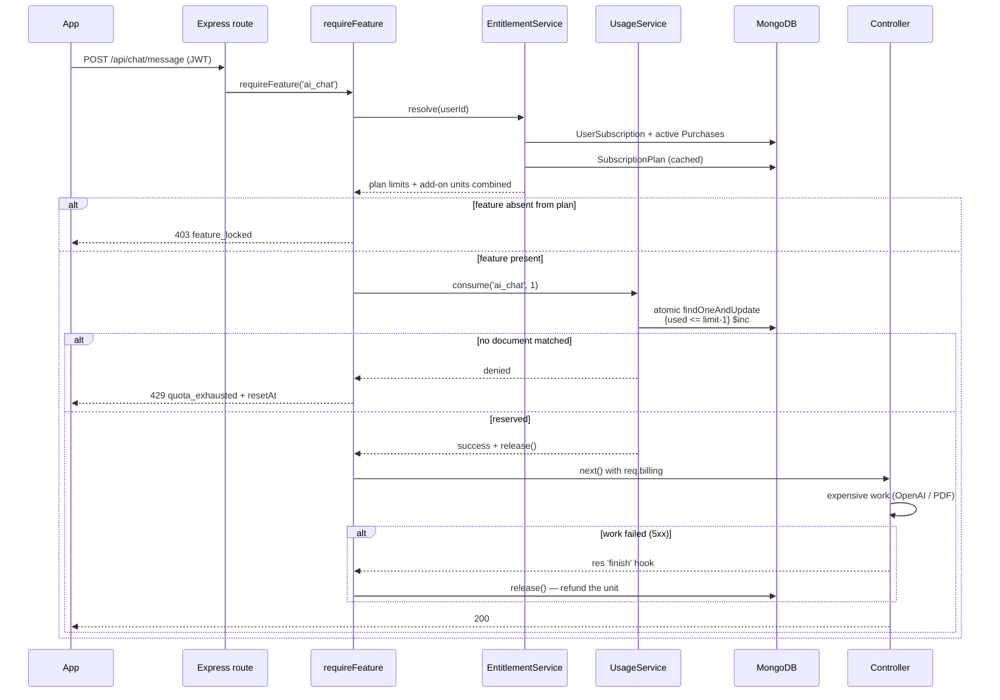
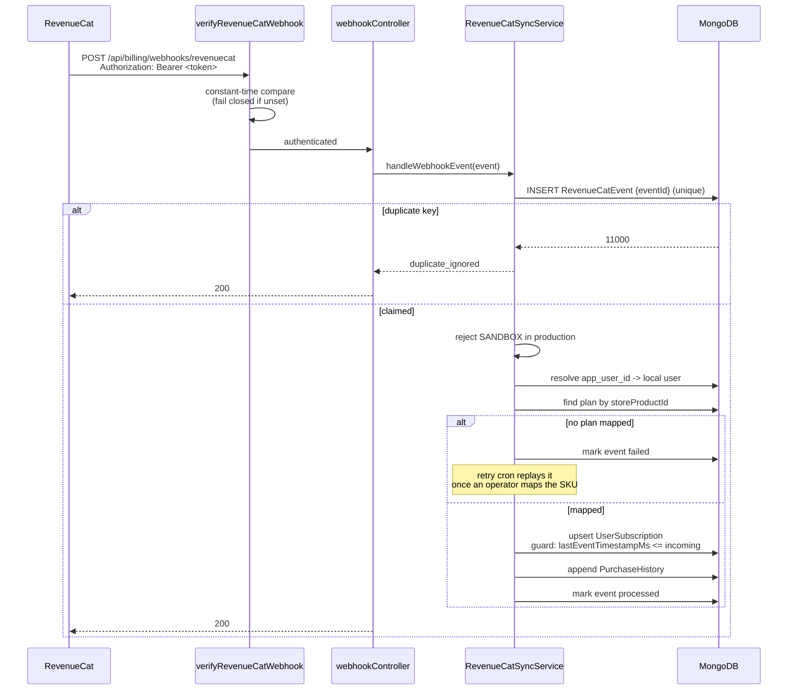

# Billing Module

RevenueCat-backed subscription, entitlement and usage system for VedicScan.

Built for Android (Google Play) first, with iOS and Web addable **without backend
changes** — a new platform only requires registering its store product IDs on the
relevant plan document.

---

## Core principles

| Principle | How it is enforced |
|---|---|
| **RevenueCat is the source of truth** | `UserSubscription` is written only by the webhook handler or after a verified REST fetch. No client input can promote a user. |
| **Nothing is hardcoded** | Plans, prices, currencies, limits, feature definitions and AI tuning parameters all live in MongoDB. Changing pricing is a data edit, not a deploy. |
| **Fail closed** | If entitlement resolution errors, the request is rejected with 503. An outage never becomes a free upgrade. |
| **Idempotent webhooks** | Every event id is claimed in a unique index *before* any state mutation, so duplicate deliveries are no-ops. |
| **Resets are self-healing** | Quotas reset via deterministic period keys, not cron. A missed job cannot corrupt limits. |

---

## Data model

```mermaid
erDiagram
    User ||--o| UserSubscription : "has one"
    User ||--o{ Purchase : "owns add-on packs"
    User ||--o{ UsageCounter : "accrues"
    User ||--o{ FeatureUnlock : "has unlocked"
    User ||--o{ PurchaseHistory : "billed"
    User ||--o{ RevenueCatEvent : "events for"

    SubscriptionPlan ||--o{ PlanEntitlement : "grants"
    SubscriptionPlan ||--o{ PlanPrice : "priced per region"
    PlanEntitlement }o--|| Feature : "references"
    UsageCounter }o--|| Feature : "meters"

    UserSubscription {
why        string  planCode          "FK -> SubscriptionPlan.code"
        string  status            "active|cancelled|expired|in_grace_period|..."
        date    expiresAt         "access ends here"
        number  lastEventTimestampMs "out-of-order guard"
    }

    SubscriptionPlan {
        string  code              "unique, e.g. standard_monthly"
        string  kind              "subscription | one_time"
        string  billingInterval   "monthly|yearly|lifetime|none"
        array   storeProductIds   "Play/App Store/Web SKUs"
        object  metadata          "AI tuning, future flags"
    }

    Feature {
        string  key               "unique, e.g. ai_chat"
        string  defaultPeriod     "daily|monthly|lifetime|none"
    }

    UsageCounter {
        string  featureKey
        string  periodKey         "2026-07-19 | 2026-07 | lifetime"
        number  used
    }

    Purchase {
        string  transactionId     "unique -> idempotency"
        array   grants            "featureKey, granted, remaining"
        date    expiresAt         "end of purchase billing day"
    }

    RevenueCatEvent {
        string  eventId           "unique -> idempotency"
        string  status            "pending|processed|failed|ignored"
        object  rawPayload        "replay source"
    }
```

> **Note on `UserSubscription` vs `Purchase`** — these are separate models because
> the semantics differ fundamentally. A subscription grants a *recurring allowance
> that resets*; a purchase grants a *fixed bucket that depletes and expires*.
> Collapsing them would force one of the two into a shape that does not fit.

---

## Request flow — premium endpoint



**Why quota is reserved before the work, not after:** if we charged afterwards, a
client could fire twenty concurrent requests that all pass the check before any
of them increments, bursting far past the limit. Reserving up front closes that
window; the `release()` handle covers the resulting "charged for failed work"
case.

---

## Webhook flow



**Why 200 even on processing failure:** RevenueCat retries non-2xx for ~72 hours.
A deterministic bug would replay identically thousands of times. The event is
already persisted with `status: 'failed'`, so *our* retry cron owns recovery
instead. We only return non-2xx when we failed to **record** the event.

---

## Yearly plans and monthly resets

A frequent source of confusion, so it is explicit in the model:

- `billingInterval` controls **when the store charges** (`yearly`).
- `entitlement.period` controls **when quotas reset** (`monthly`).

These are deliberately independent fields. That is precisely how a yearly
subscriber receives fresh limits every month for the whole year — no special-case
logic anywhere.

---

## Adding a new premium feature

No business logic changes required:

1. Insert a `Feature` document with a new `key`.
2. Add an entitlement `{ featureKey, limit, period }` to the relevant plans.
3. Add the key to `FEATURE_KEYS` in `constants.ts` (for compile-time safety).
4. Apply the middleware to the route:

```ts
router.post('/thing', requireFeature(FEATURE_KEYS.MY_FEATURE), controller.thing);
```

Use `requireFeatureOnce` instead when the endpoint can be called repeatedly for
the same underlying resource (PDF downloads, re-renders) — it charges once per
resource rather than once per request.

---

## Adding iOS or Web later

No backend changes. In order:

1. Create the products in App Store Connect / RevenueCat Web Billing.
2. Attach them to the **same** RevenueCat entitlement (`standard_access`).
3. Add the new product IDs to the existing plan documents' `storeProductIds`.

`planRepository.findByStoreProductId()` resolves them immediately, and
`STORE_TO_PLATFORM` already maps `APP_STORE` and `RC_BILLING`.

---

## Verification

```bash
# Pure period-boundary logic (no DB)
npx ts-node --transpile-only src/modules/billing/__checks__/period.check.ts

# Full engine against an ephemeral in-memory MongoDB — never touches your
# configured database
npx ts-node --transpile-only src/modules/billing/__checks__/engine.check.ts
```

The engine check covers concurrency, add-on stacking, expiry, lapsed
subscriptions, cancelled-but-paid access, and unlock idempotency.

---

## Operational notes

- **Multi-replica:** every cron job is idempotent, so concurrent execution is
  safe but wasteful. Set `BILLING_CRON_ENABLED=false` on all but one instance.
- **Plan cache:** plans are cached in-process for `PLAN_CACHE_TTL_MS`. A price
  change propagates to all replicas within that window.
- **Kill switch:** `BILLING_ENFORCEMENT_ENABLED=false` bypasses all gating while
  still recording usage. Defaults to enabled — enforcement cannot lapse through a
  missing env var.
